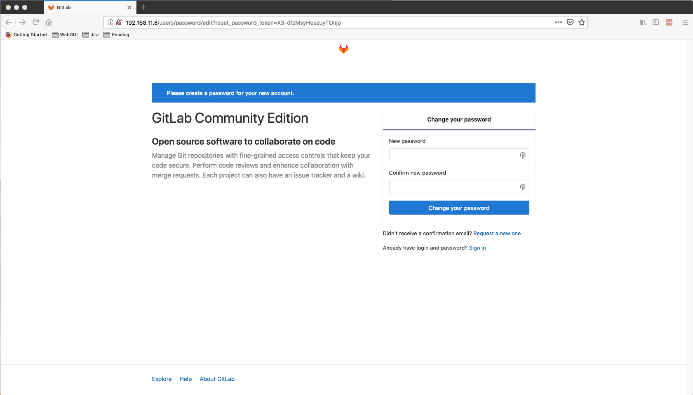
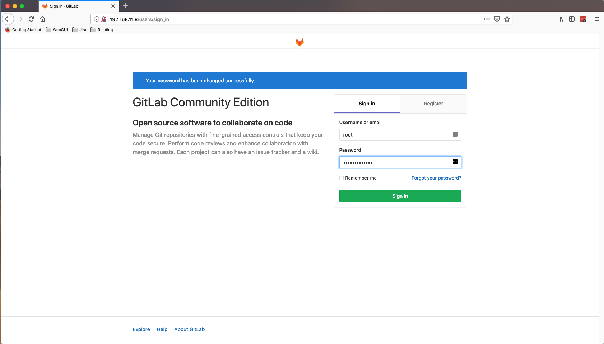
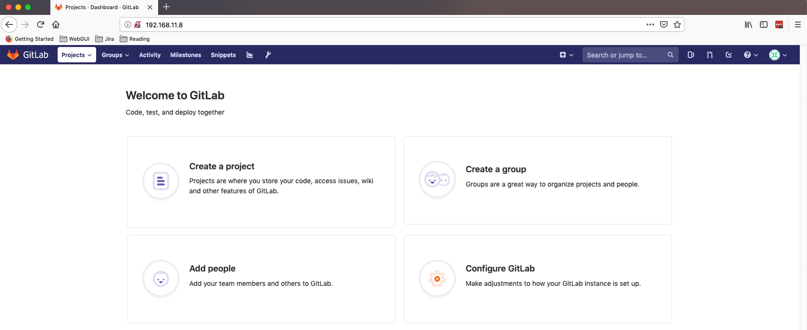
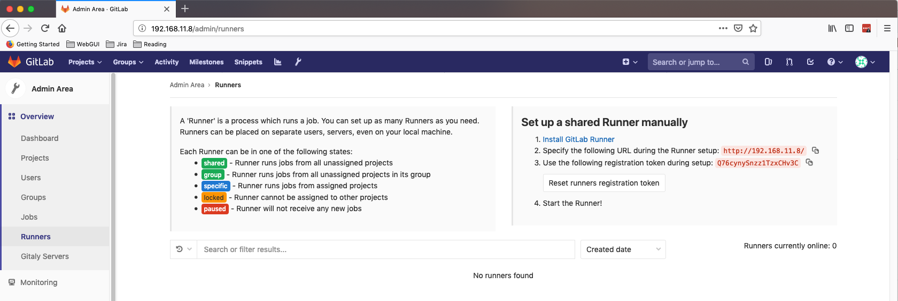
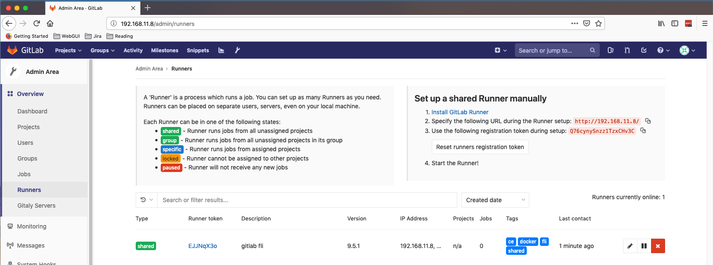

# gitlab-local-dev
Create local gitlab environment by using Vagrant / VirtualBox

## clone this repo

```
$ git clone https://github.com/fen9li/gitlab-local-dev.git
Cloning into 'gitlab-local-dev'...
remote: Enumerating objects: 4, done.
remote: Counting objects: 100% (4/4), done.
remote: Compressing objects: 100% (4/4), done.
remote: Total 4 (delta 0), reused 0 (delta 0), pack-reused 0
Receiving objects: 100% (4/4), 4.54 KiB | 2.27 MiB/s, done.
$
```

## start gitlab ce local dev environment

```
cd gitlab-local-dev/
vagrant up
```

## reset GitLab local root user password

* Access GitLab Local Dev environment @ http://192.168.11.8



* Reset root user password 



* The homepage



## register GitLab runner

* No runners registered 



* SSH to GitLab vagrant vm and register new GitLab runner

```
$ vagrant ssh
Welcome to Ubuntu 16.04.5 LTS (GNU/Linux 4.4.0-142-generic x86_64)

 * Documentation:  https://help.ubuntu.com
 * Management:     https://landscape.canonical.com
 * Support:        https://ubuntu.com/advantage

  Get cloud support with Ubuntu Advantage Cloud Guest:
    http://www.ubuntu.com/business/services/cloud

16 packages can be updated.
13 updates are security updates.

New release '18.04.2 LTS' available.
Run 'do-release-upgrade' to upgrade to it.


Last login: Sun Mar 10 01:00:14 2019 from 10.0.2.2
vagrant@gitlab:~$
vagrant@gitlab:~$ sudo gitlab-runner register
Running in system-mode.                            
                                                   
Please enter the gitlab-ci coordinator URL (e.g. https://gitlab.com/):
http://192.168.11.8/
Please enter the gitlab-ci token for this runner:
Q76cynySnzz1TzxCHv3C
Please enter the gitlab-ci description for this runner:
[gitlab]: gitlab fli
Please enter the gitlab-ci tags for this runner (comma separated):
docker,shared,ce,fli
Whether to run untagged builds [true/false]:
[false]: 
Whether to lock Runner to current project [true/false]:
[false]: 
Registering runner... succeeded                     runner=Q76cynyS
Please enter the executor: kubernetes, docker-ssh, parallels, docker-ssh+machine, virtualbox, docker+machine, docker, shell, ssh:
docker
Please enter the default Docker image (e.g. ruby:2.1):
alpine:latest
Runner registered successfully. Feel free to start it, but if it's running already the config should be automatically reloaded! 
vagrant@gitlab:~$ 

vagrant@gitlab:~$ exit
logout
Connection to 127.0.0.1 closed.
$
```

* Ensure new runner has been registered successfully



## Comments and Feedback
